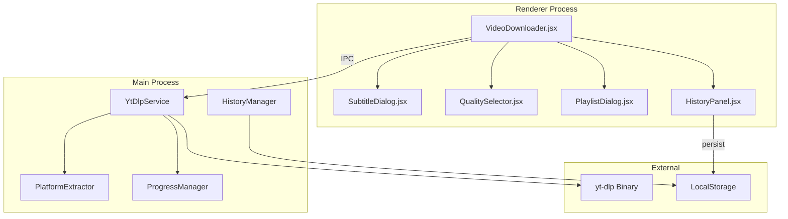

# Design Document: Media Downloader Enhancement

## Overview

This design document outlines the architecture and implementation approach for enhancing the Media Downloader module in ProFlow Studio. The enhancements include bug fixes for subtitle parsing, progress display, and file size display, as well as new features for multi-platform support, quality/format selection, download history, and batch downloads.

The implementation leverages the existing yt-dlp backend service while adding platform-specific extraction methods and improved UI components.

## Architecture



## Components and Interfaces

### 1. Platform Detection Module

```javascript
// platformDetector.js
const PLATFORM_PATTERNS = {
    youtube: [
        /(?:youtube\.com|youtu\.be)/i,
        /(?:youtube\.com\/(?:watch|embed|v|shorts))/i
    ],
    bilibili: [
        /bilibili\.com/i,
        /b23\.tv/i
    ],
    douyin: [
        /douyin\.com/i,
        /iesdouyin\.com/i
    ]
};

function detectPlatform(url) {
    for (const [platform, patterns] of Object.entries(PLATFORM_PATTERNS)) {
        if (patterns.some(p => p.test(url))) {
            return platform;
        }
    }
    return null;
}

function getPlatformIcon(platform) {
    const icons = {
        youtube: 'youtube-icon',
        bilibili: 'bilibili-icon',
        douyin: 'douyin-icon'
    };
    return icons[platform] || 'generic-video-icon';
}
```

### 2. Enhanced Subtitle Extraction

```javascript
// subtitleExtractor.js
function extractSubtitles(videoInfo) {
    const subtitles = {};
    
    // Manual subtitles (higher priority)
    if (videoInfo.subtitles) {
        for (const [lang, formats] of Object.entries(videoInfo.subtitles)) {
            subtitles[lang] = {
                formats: formats,
                isAuto: false,
                label: getLanguageLabel(lang)
            };
        }
    }
    
    // Auto-generated captions
    if (videoInfo.automatic_captions) {
        for (const [lang, formats] of Object.entries(videoInfo.automatic_captions)) {
            const key = `${lang}_auto`;
            subtitles[key] = {
                formats: formats,
                isAuto: true,
                label: `${getLanguageLabel(lang)} [Auto]`
            };
        }
    }
    
    return subtitles;
}

function getLanguageLabel(langCode) {
    const labels = {
        'en': 'English',
        'zh': 'Chinese',
        'zh-Hans': 'Chinese (Simplified)',
        'zh-Hant': 'Chinese (Traditional)',
        'ja': 'Japanese',
        'ko': 'Korean',
        // ... more languages
    };
    return labels[langCode] || langCode;
}
```

### 3. Progress Parser

```javascript
// progressParser.js
function parseYtDlpProgress(output) {
    const result = {
        percent: null,
        speed: null,
        eta: null,
        downloaded: null,
        total: null
    };
    
    // Parse percentage: "  45.3%" or "[download]  45.3% of"
    const percentMatch = output.match(/(\d+\.?\d*)%/);
    if (percentMatch) {
        result.percent = parseFloat(percentMatch[1]);
    }
    
    // Parse speed: "1.23MiB/s" or "500KiB/s"
    const speedMatch = output.match(/([\d.]+)\s*(MiB|KiB|GiB)\/s/i);
    if (speedMatch) {
        const value = parseFloat(speedMatch[1]);
        const unit = speedMatch[2].toLowerCase();
        result.speed = formatSpeed(value, unit);
    }
    
    // Parse ETA: "ETA 01:23" or "00:45"
    const etaMatch = output.match(/ETA\s*(\d+:\d+(?::\d+)?)/i);
    if (etaMatch) {
        result.eta = etaMatch[1];
    }
    
    // Parse downloaded/total: "10.5MiB of 100MiB"
    const sizeMatch = output.match(/([\d.]+)\s*(MiB|KiB|GiB)\s*of\s*([\d.]+)\s*(MiB|KiB|GiB)/i);
    if (sizeMatch) {
        result.downloaded = formatSize(parseFloat(sizeMatch[1]), sizeMatch[2]);
        result.total = formatSize(parseFloat(sizeMatch[3]), sizeMatch[4]);
    }
    
    return result;
}

function formatSpeed(value, unit) {
    if (unit === 'kib') return `${(value / 1024).toFixed(2)} MB/s`;
    if (unit === 'mib') return `${value.toFixed(2)} MB/s`;
    if (unit === 'gib') return `${(value * 1024).toFixed(2)} MB/s`;
    return `${value} ${unit}/s`;
}

function formatSize(bytes, unit) {
    // Convert to bytes first
    let inBytes = bytes;
    if (unit.toLowerCase() === 'kib') inBytes = bytes * 1024;
    if (unit.toLowerCase() === 'mib') inBytes = bytes * 1024 * 1024;
    if (unit.toLowerCase() === 'gib') inBytes = bytes * 1024 * 1024 * 1024;
    
    if (inBytes < 1024 * 1024) return `${(inBytes / 1024).toFixed(1)} KB`;
    if (inBytes < 1024 * 1024 * 1024) return `${(inBytes / 1024 / 1024).toFixed(1)} MB`;
    return `${(inBytes / 1024 / 1024 / 1024).toFixed(2)} GB`;
}
```

### 4. Quality Extraction

```javascript
// qualityExtractor.js
function extractQualities(formats) {
    const qualities = new Map();
    
    for (const format of formats) {
        if (!format.height) continue;
        
        const height = format.height;
        const label = getQualityLabel(height);
        
        if (!qualities.has(label) || format.filesize > qualities.get(label).filesize) {
            qualities.set(label, {
                height: height,
                label: label,
                formatId: format.format_id,
                filesize: format.filesize || format.filesize_approx,
                ext: format.ext,
                vcodec: format.vcodec,
                acodec: format.acodec
            });
        }
    }
    
    // Sort by height descending
    return Array.from(qualities.values())
        .sort((a, b) => b.height - a.height);
}

function getQualityLabel(height) {
    if (height >= 2160) return '4K';
    if (height >= 1440) return '1440p';
    if (height >= 1080) return '1080p';
    if (height >= 720) return '720p';
    if (height >= 480) return '480p';
    if (height >= 360) return '360p';
    return `${height}p`;
}

// Bilibili-specific quality mapping
function mapBilibiliQuality(qn) {
    const mapping = {
        127: '8K',
        126: 'Dolby Vision',
        125: 'HDR',
        120: '4K',
        116: '1080P60',
        112: '1080P+',
        80: '1080P',
        74: '720P60',
        64: '720P',
        32: '480P',
        16: '360P'
    };
    return mapping[qn] || `${qn}`;
}
```

### 5. History Manager

```javascript
// historyManager.js
const HISTORY_KEY = 'downloadHistory';
const MAX_HISTORY_ITEMS = 100;

function saveToHistory(item) {
    const history = getHistory();
    const newItem = {
        id: item.id || Date.now().toString(),
        title: item.title,
        thumbnail: item.thumbnail,
        platform: item.platform,
        type: item.type, // 'video', 'audio', 'subtitle'
        quality: item.quality,
        size: item.size,
        filePath: item.filePath,
        url: item.url,
        completedAt: new Date().toISOString()
    };
    
    // Remove duplicate if exists
    const filtered = history.filter(h => h.id !== newItem.id);
    
    // Add to front and limit size
    const updated = [newItem, ...filtered].slice(0, MAX_HISTORY_ITEMS);
    
    localStorage.setItem(HISTORY_KEY, JSON.stringify(updated));
    return updated;
}

function getHistory() {
    try {
        const saved = localStorage.getItem(HISTORY_KEY);
        return saved ? JSON.parse(saved) : [];
    } catch {
        return [];
    }
}

function clearHistory() {
    localStorage.removeItem(HISTORY_KEY);
    return [];
}

function removeFromHistory(id) {
    const history = getHistory();
    const updated = history.filter(h => h.id !== id);
    localStorage.setItem(HISTORY_KEY, JSON.stringify(updated));
    return updated;
}
```

## Data Models

### VideoInfo

```typescript
interface VideoInfo {
    id: string;
    title: string;
    thumbnail: string;
    uploader: string;
    duration: number;
    duration_string: string;
    filesize: number | null;
    url: string;
    webpage_url: string;
    ext: string;
    extractor: string;
    platform: 'youtube' | 'bilibili' | 'douyin' | 'other';
    headers?: Record<string, string>;
    subtitles: SubtitleInfo;
    formats: FormatInfo[];
    qualities: QualityOption[];
    isPlaylist: boolean;
    playlistItems?: PlaylistItem[];
}

interface SubtitleInfo {
    [langCode: string]: {
        formats: SubtitleFormat[];
        isAuto: boolean;
        label: string;
    };
}

interface SubtitleFormat {
    ext: string;
    url: string;
    name?: string;
}

interface FormatInfo {
    format_id: string;
    ext: string;
    height?: number;
    width?: number;
    filesize?: number;
    filesize_approx?: number;
    vcodec?: string;
    acodec?: string;
    url: string;
}

interface QualityOption {
    height: number;
    label: string;
    formatId: string;
    filesize: number | null;
    ext: string;
}

interface PlaylistItem {
    id: string;
    title: string;
    thumbnail: string;
    duration: number;
    selected: boolean;
}
```

### DownloadProgress

```typescript
interface DownloadProgress {
    id: string;
    percent: number;
    speed: string | null;
    eta: string | null;
    downloaded: string | null;
    total: string | null;
    status: 'Starting...' | 'Active' | 'Paused' | 'Completed' | 'Failed' | 'Cancelled';
}
```

### HistoryItem

```typescript
interface HistoryItem {
    id: string;
    title: string;
    thumbnail: string;
    platform: string;
    type: 'video' | 'audio' | 'subtitle';
    quality?: string;
    size?: string;
    filePath: string;
    url: string;
    completedAt: string;
}
```

## Correctness Properties

*A property is a characteristic or behavior that should hold true across all valid executions of a system—essentially, a formal statement about what the system should do. Properties serve as the bridge between human-readable specifications and machine-verifiable correctness guarantees.*

### Property 1: Platform Detection Consistency

*For any* valid URL from a supported platform (YouTube, Bilibili, Douyin), the platform detector SHALL return the correct platform identifier, and *for any* URL not matching supported patterns, it SHALL return null.

**Validates: Requirements 1.4, 1.6**

### Property 2: Subtitle Extraction Completeness

*For any* video info object containing subtitles or automatic_captions, the subtitle extractor SHALL include all available languages, and auto-generated captions SHALL be labeled with "[Auto]" suffix.

**Validates: Requirements 2.1, 2.2**

### Property 3: Progress Parsing Accuracy

*For any* yt-dlp output string containing progress information, the progress parser SHALL correctly extract the percentage (0-100), and if speed/ETA information is present, it SHALL be formatted in human-readable units (MB/s, HH:MM:SS).

**Validates: Requirements 3.3, 3.4, 3.5**

### Property 4: File Size Extraction with Fallback

*For any* video info object, the file size extractor SHALL return the filesize if available, otherwise attempt to get filesize_approx, otherwise search formats array for size information. The result SHALL be formatted in appropriate units (KB/MB/GB).

**Validates: Requirements 4.1, 4.2**

### Property 5: Quality Extraction and Sorting

*For any* formats array containing video formats with height information, the quality extractor SHALL return unique quality options sorted by resolution (highest first), with each option containing the format ID and estimated file size.

**Validates: Requirements 5.1, 5.3, 5.4**

### Property 6: History Persistence Round-Trip

*For any* download history item saved to localStorage, retrieving the history SHALL return an equivalent item with all fields preserved (title, thumbnail, platform, type, filePath, completedAt).

**Validates: Requirements 7.1, 7.2, 7.3**

### Property 7: Default Format Selection

*For any* download request without explicit format selection, the system SHALL default to MP4 for video downloads and M4A for audio downloads.

**Validates: Requirements 6.3**

### Property 8: Playlist Detection

*For any* URL containing playlist indicators (YouTube playlist ID, Bilibili collection), the parser SHALL detect it as a playlist and return the list of contained videos.

**Validates: Requirements 8.1**

## Error Handling

### Network Errors
- Timeout after 30 seconds for video info requests
- Retry up to 3 times with exponential backoff
- Display user-friendly error messages

### Platform-Specific Errors
- YouTube: Handle age-restricted content, private videos
- Bilibili: Handle region-locked content, login requirements
- Douyin: Handle watermark extraction failures

### Download Errors
- Partial file cleanup on cancel/failure
- Resume support for interrupted downloads
- Clear error messages with suggested actions

## Testing Strategy

### Unit Tests
- Platform detection with various URL formats
- Progress parsing with different yt-dlp output formats
- File size formatting edge cases
- Quality extraction from formats array
- History CRUD operations

### Property-Based Tests
Using fast-check for JavaScript:

1. **Platform Detection Property Test**
   - Generate random URLs matching platform patterns
   - Verify correct platform identification
   - Test edge cases (short URLs, mobile URLs)

2. **Progress Parsing Property Test**
   - Generate random progress strings with various formats
   - Verify percentage extraction accuracy
   - Test speed/ETA parsing

3. **File Size Formatting Property Test**
   - Generate random byte values
   - Verify correct unit selection (KB/MB/GB)
   - Test boundary conditions

4. **History Round-Trip Property Test**
   - Generate random history items
   - Save and retrieve
   - Verify data integrity

### Integration Tests
- End-to-end download flow
- Subtitle download verification
- Batch download with progress tracking
