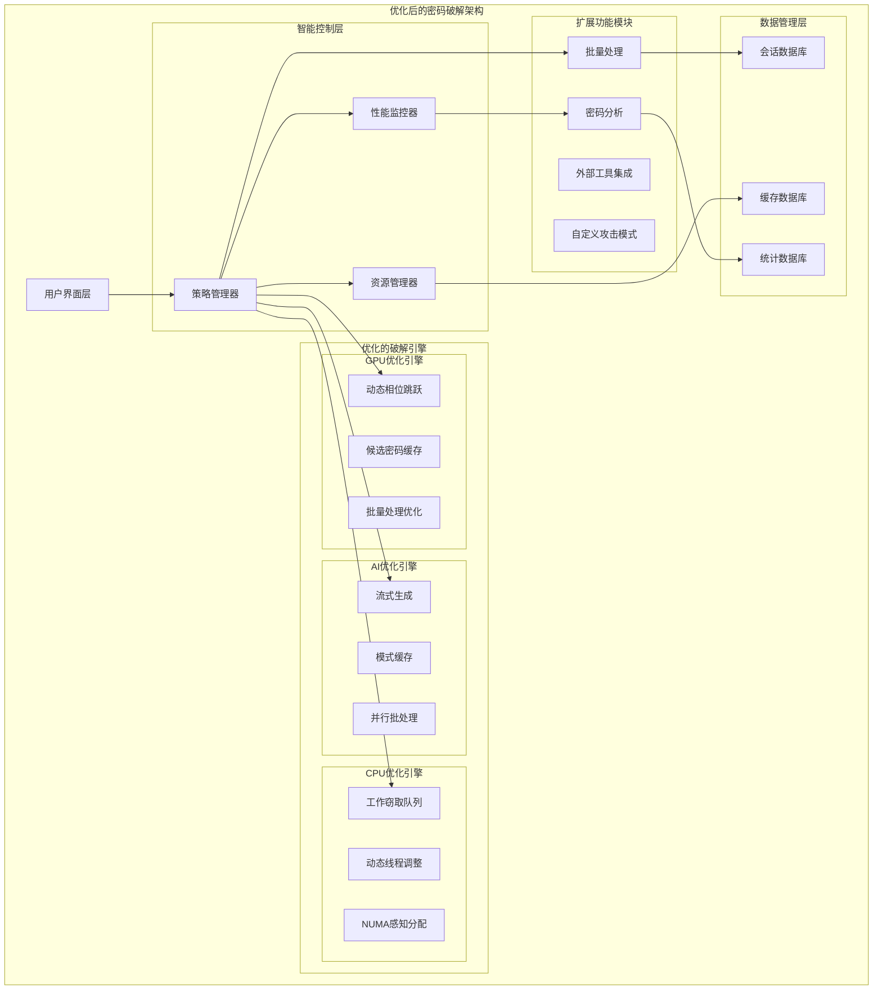

# Design Document: 压缩包密码破解板块全面优化

## Overview

基于现有的7层递进破解策略，从效率和选项两个维度进行全面优化。系统将保持现有架构的稳定性，通过智能优化算法、资源管理、用户体验增强等方式，实现破解效率提升50-200%，同时扩展高级功能选项。

## Architecture



## Components and Interfaces

### 1. 智能策略管理器 (Enhanced Strategy Manager)

扩展现有的StrategySelector，增加动态优化能力。

```javascript
class EnhancedStrategyManager {
    // 动态策略调整
    async adjustStrategy(fileCharacteristics, hardwareProfile, userPreferences) {
        const strategy = this.selectBaseStrategy(fileCharacteristics);
        
        // 应用硬件优化
        strategy.phases = this.optimizeForHardware(strategy.phases, hardwareProfile);
        
        // 应用用户偏好
        strategy.phases = this.applyUserPreferences(strategy.phases, userPreferences);
        
        // 设置动态超时
        strategy.timeouts = this.calculateAdaptiveTimeouts(fileCharacteristics);
        
        return strategy;
    }
    
    // 实时策略调整
    async adjustPhaseInRealtime(currentPhase, performance, elapsedTime) {
        if (performance.efficiency < 0.1 && elapsedTime > 30000) {
            return { action: 'skip', reason: 'Low efficiency detected' };
        }
        
        if (performance.memoryUsage > 0.8) {
            return { action: 'reduce_batch_size', factor: 0.5 };
        }
        
        return { action: 'continue' };
    }
}
```

### 2. 性能监控器 (Performance Monitor)

实时监控系统性能，提供优化建议。

```javascript
class PerformanceMonitor {
    constructor() {
        this.metrics = {
            cpuUsage: 0,
            memoryUsage: 0,
            gpuUsage: 0,
            diskIO: 0,
            networkIO: 0,
            passwordsPerSecond: 0,
            efficiency: 0
        };
    }
    
    // 实时性能监控
    startMonitoring(callback) {
        setInterval(() => {
            this.updateMetrics();
            const analysis = this.analyzePerformance();
            callback(this.metrics, analysis);
        }, 1000);
    }
    
    // 性能瓶颈检测
    analyzePerformance() {
        const bottlenecks = [];
        
        if (this.metrics.cpuUsage > 0.9) {
            bottlenecks.push({
                type: 'cpu',
                severity: 'high',
                suggestion: 'Reduce worker threads or enable CPU throttling'
            });
        }
        
        if (this.metrics.memoryUsage > 0.8) {
            bottlenecks.push({
                type: 'memory',
                severity: 'high',
                suggestion: 'Reduce batch sizes or enable disk caching'
            });
        }
        
        return { bottlenecks, efficiency: this.calculateEfficiency() };
    }
}
```

### 3. 资源管理器 (Resource Manager)

智能管理系统资源，优化性能。

```javascript
class ResourceManager {
    constructor() {
        this.resourceLimits = this.detectHardwareLimits();
        this.currentUsage = {};
    }
    
    // 动态资源分配
    async allocateResources(taskType, priority) {
        const available = this.getAvailableResources();
        
        switch (taskType) {
            case 'gpu_crack':
                return this.allocateGPUResources(available, priority);
            case 'cpu_crack':
                return this.allocateCPUResources(available, priority);
            case 'ai_generation':
                return this.allocateAIResources(available, priority);
            default:
                return this.allocateDefaultResources(available);
        }
    }
    
    // NUMA感知线程分配
    allocateNUMAThreads(threadCount) {
        const numaNodes = this.detectNUMATopology();
        const threadsPerNode = Math.ceil(threadCount / numaNodes.length);
        
        return numaNodes.map(node => ({
            nodeId: node.id,
            threadCount: Math.min(threadsPerNode, node.availableCores),
            memoryAffinity: node.memoryBanks
        }));
    }
}
```

### 4. 优化的GPU破解引擎

增强现有GPU破解功能。

```javascript
class OptimizedGPUEngine {
    constructor() {
        this.phaseCache = new Map();
        this.candidateCache = new LRUCache(10000);
    }
    
    // 动态相位跳跃
    async runPhaseWithSkipping(phase, context) {
        const startTime = Date.now();
        const skipThreshold = this.calculateSkipThreshold(phase, context);
        
        const result = await this.runPhaseWithTimeout(phase, skipThreshold);
        
        if (result.skipped) {
            console.log(`[GPU] Phase ${phase.name} skipped after ${result.elapsed}ms (low efficiency)`);
            this.recordPhaseSkip(phase, context, result.reason);
        }
        
        return result;
    }
    
    // 候选密码缓存
    getCachedCandidates(pattern) {
        const cacheKey = this.generateCacheKey(pattern);
        return this.candidateCache.get(cacheKey) || null;
    }
    
    setCachedCandidates(pattern, candidates) {
        const cacheKey = this.generateCacheKey(pattern);
        this.candidateCache.set(cacheKey, candidates);
    }
}
```

### 5. 流式AI密码生成器

优化PassGPT生成效率。

```javascript
class StreamingAIGenerator {
    constructor() {
        this.batchSize = 100;
        this.maxConcurrentBatches = 4;
        this.patternCache = new Map();
    }
    
    // 流式生成密码
    async* generatePasswordStream(totalCount, options) {
        let generated = 0;
        const activeBatches = [];
        
        while (generated < totalCount) {
            // 启动并行批次
            while (activeBatches.length < this.maxConcurrentBatches && generated < totalCount) {
                const batchPromise = this.generateBatch(this.batchSize, options);
                activeBatches.push(batchPromise);
            }
            
            // 等待第一个批次完成
            const batch = await Promise.race(activeBatches);
            const index = activeBatches.indexOf(batch);
            activeBatches.splice(index, 1);
            
            // 过滤重复和缓存模式
            const filteredBatch = this.filterAndCache(batch);
            
            for (const password of filteredBatch) {
                if (generated >= totalCount) break;
                yield password;
                generated++;
            }
        }
    }
    
    // 模式缓存和去重
    filterAndCache(passwords) {
        const filtered = [];
        const seen = new Set();
        
        for (const pwd of passwords) {
            if (!seen.has(pwd) && pwd.length > 0) {
                seen.add(pwd);
                filtered.push(pwd);
                
                // 缓存常见模式
                const pattern = this.extractPattern(pwd);
                this.cachePattern(pattern, pwd);
            }
        }
        
        return filtered;
    }
}
```

### 6. 批量处理管理器

支持多文件批量破解。

```javascript
class BatchProcessingManager {
    constructor() {
        this.queue = [];
        this.activeJobs = new Map();
        this.sharedPatterns = new Set();
        this.maxConcurrent = 2;
    }
    
    // 添加批量任务
    addBatch(files, options) {
        const batchId = this.generateBatchId();
        const batch = {
            id: batchId,
            files: files.map(file => ({
                path: file,
                status: 'pending',
                priority: this.calculatePriority(file),
                estimatedTime: this.estimateTime(file)
            })),
            options,
            createdAt: Date.now()
        };
        
        // 按优先级排序
        batch.files.sort((a, b) => b.priority - a.priority);
        this.queue.push(batch);
        
        return batchId;
    }
    
    // 智能模式共享
    async processBatchWithSharedLearning(batchId) {
        const batch = this.getBatch(batchId);
        
        for (const file of batch.files) {
            if (file.status !== 'pending') continue;
            
            // 应用已学习的模式
            const learnedPatterns = Array.from(this.sharedPatterns);
            if (learnedPatterns.length > 0) {
                const quickResult = await this.tryLearnedPatterns(file.path, learnedPatterns);
                if (quickResult.found) {
                    file.status = 'completed';
                    file.password = quickResult.password;
                    continue;
                }
            }
            
            // 正常破解流程
            const result = await this.crackFile(file.path, batch.options);
            file.status = result.found ? 'completed' : 'failed';
            
            if (result.found) {
                file.password = result.password;
                // 学习成功模式
                this.learnPattern(result.password, result.method);
            }
        }
    }
}
```

## Data Models

### 优化配置模型
```javascript
interface OptimizationConfig {
    mode: 'speed' | 'balanced' | 'thorough';
    enablePhaseSkipping: boolean;
    enableResourceThrottling: boolean;
    enablePatternCaching: boolean;
    maxMemoryUsage: number; // 0.0-1.0
    maxCPUUsage: number;    // 0.0-1.0
    customTimeouts: {
        [phaseName: string]: number;
    };
}
```

### 性能指标模型
```javascript
interface PerformanceMetrics {
    timestamp: number;
    cpuUsage: number;
    memoryUsage: number;
    gpuUsage: number;
    passwordsPerSecond: number;
    efficiency: number;
    activePhase: string;
    bottlenecks: BottleneckInfo[];
}
```

### 批量任务模型
```javascript
interface BatchJob {
    id: string;
    files: BatchFile[];
    options: CrackOptions;
    status: 'pending' | 'running' | 'completed' | 'failed';
    progress: {
        completed: number;
        total: number;
        currentFile: string;
    };
    sharedPatterns: string[];
    startTime: number;
    estimatedCompletion: number;
}
```

## Correctness Properties

*A property is a characteristic or behavior that should hold true across all valid executions of a system-essentially, a formal statement about what the system should do.*

### Property 1: Resource Usage Bounds
*For any* cracking session with resource limits configured, the system SHALL NOT exceed the specified CPU, memory, or GPU usage limits.
**Validates: Requirements 3.3, 12.3**

### Property 2: Phase Skipping Efficiency
*For any* phase that runs longer than its adaptive timeout without progress, the system SHALL automatically skip to the next phase.
**Validates: Requirements 1.2, 1.5**

### Property 3: Batch Processing Consistency
*For any* batch job, when a password is found for one file, the system SHALL test that password on all remaining files in the batch.
**Validates: Requirements 7.5**

### Property 4: Cache Consistency
*For any* cached password pattern, subsequent requests for the same pattern SHALL return identical results.
**Validates: Requirements 4.1, 2.4**

### Property 5: Performance Monitoring Accuracy
*For any* performance metric reported, the measurement SHALL be within 5% accuracy of the actual system resource usage.
**Validates: Requirements 12.1, 12.2**

### Property 6: Session Recovery Completeness
*For any* interrupted session, resuming SHALL restore the exact state including progress, cached patterns, and learned optimizations.
**Validates: Requirements 11.1, 11.2**

## Error Handling

### 资源不足处理
- **内存不足**: 自动减少批次大小，启用磁盘缓存
- **CPU过载**: 动态减少工作线程数量
- **GPU内存不足**: 回退到CPU模式或减少GPU批次大小

### 外部工具故障
- **Hashcat崩溃**: 自动重启或回退到CPU模式
- **PassGPT模型加载失败**: 使用传统字典攻击
- **bkcrack不可用**: 跳过已知明文攻击阶段

### 数据完整性保护
- **会话数据损坏**: 从备份恢复或重新开始
- **缓存数据无效**: 清除缓存并重新生成
- **统计数据异常**: 重置统计并继续运行

## Testing Strategy

### 单元测试
- 资源管理器的分配算法
- 性能监控器的指标计算
- 缓存系统的一致性
- 批量处理的任务调度

### 集成测试
- 完整破解流程的端到端测试
- 多文件批量处理测试
- 资源限制下的系统行为
- 会话恢复功能测试

### 性能测试
- 不同硬件配置下的性能基准
- 内存和CPU使用效率测试
- 缓存命中率和效果测试
- 批量处理的扩展性测试

### 压力测试
- 高负载下的系统稳定性
- 资源耗尽场景的处理
- 长时间运行的内存泄漏检测
- 并发批量任务的处理能力