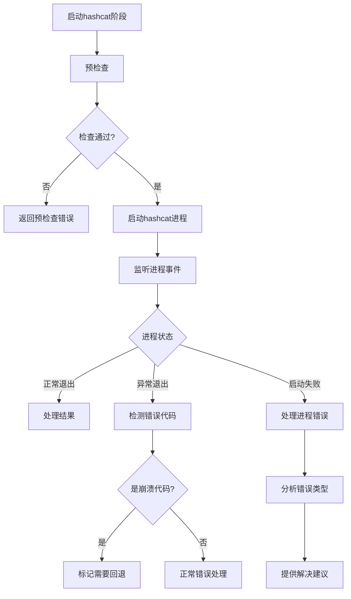
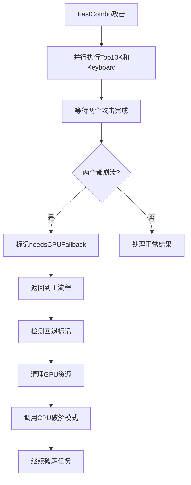

# 密码破解快速阶段跳过问题修复 - 设计文档

## 🏗️ 架构概览

### 问题根因分析

**核心问题**: hashcat进程崩溃导致的神秘错误代码 `4294967295`

```
[Crack] Phase FastCombo finished, code: 4294967295, found: false
[Crack] FastCombo: Result from Keyboard: FAILED  
[Crack] FastCombo: All attacks failed, combined attempts: 0
```

**根本原因**:
1. hashcat进程无法启动或立即崩溃
2. 缺乏适当的错误检测和诊断
3. 没有自动回退机制
4. 错误信息对用户不友好

## 🔧 解决方案设计

### 1. 增强错误检测系统

#### 1.1 异常退出代码检测

```javascript
// 在 runHashcatPhase 函数中
proc.on('close', (code) => {
    // ✅ 检查异常退出代码
    if (code === 4294967295 || code < 0 || code > 10) {
        console.error(`[Crack] ❌ Phase ${phaseName} crashed with abnormal code: ${code}`);
        console.error('[Debug] This usually indicates hashcat failed to start or crashed immediately');
        console.error('[Debug] Hashcat path:', hashcatPath);
        console.error('[Debug] Working directory:', hashcatDir);
        console.error('[Debug] Command args:', fullArgs.join(' '));
        
        resolve({ 
            found: null, 
            attempts: totalAttempts, 
            exhausted: false, 
            error: true, 
            crashCode: code 
        });
        return;
    }
    
    // 正常处理...
});
```

#### 1.2 启动前预检查机制

```javascript
async function runHashcatPhase(hashFile, outFile, hashMode, args, phaseName, event, id, session, previousAttempts = 0) {
    const hashcatPath = getHashcatPath();
    const hashcatDir = getHashcatDir();
    
    // ✅ 预检查 - 确保 hashcat 可执行文件存在
    if (!fs.existsSync(hashcatPath)) {
        console.error('[Crack] ❌ Hashcat executable not found:', hashcatPath);
        console.error('[Debug] Please check if hashcat is properly installed');
        return { 
            found: null, 
            attempts: previousAttempts, 
            exhausted: false, 
            error: true, 
            errorType: 'hashcat_not_found' 
        };
    }
    
    // ✅ 检查 hash 文件是否存在
    if (!fs.existsSync(hashFile)) {
        console.error('[Crack] ❌ Hash file not found:', hashFile);
        return { 
            found: null, 
            attempts: previousAttempts, 
            exhausted: false, 
            error: true, 
            errorType: 'hash_file_not_found' 
        };
    }
    
    // ✅ 检查工作目录是否存在
    if (!fs.existsSync(hashcatDir)) {
        console.error('[Crack] ❌ Hashcat directory not found:', hashcatDir);
        return { 
            found: null, 
            attempts: previousAttempts, 
            exhausted: false, 
            error: true, 
            errorType: 'hashcat_dir_not_found' 
        };
    }
    
    console.log(`[Crack] ✅ Pre-checks passed for phase: ${phaseName}`);
    // 继续正常执行...
}
```

#### 1.3 详细进程错误处理

```javascript
proc.on('error', (err) => {
    console.error(`[Crack] ❌ Phase ${phaseName} process error:`, err.message);
    console.error('[Debug] Full error details:', {
        code: err.code,
        errno: err.errno,
        syscall: err.syscall,
        path: err.path,
        spawnargs: err.spawnargs
    });
    
    // 提供具体的错误建议
    if (err.code === 'ENOENT') {
        console.error('[Suggestion] Hashcat executable not found. Please check installation.');
    } else if (err.code === 'EACCES') {
        console.error('[Suggestion] Permission denied. Please check file permissions.');
    } else if (err.code === 'EPERM') {
        console.error('[Suggestion] Operation not permitted. May be blocked by antivirus.');
    }
    
    resolve({ 
        found: null, 
        attempts: totalAttempts, 
        exhausted: false, 
        error: true, 
        errorCode: err.code 
    });
});
```

### 2. 自动回退机制

#### 2.1 GPU崩溃检测

```javascript
// 在 runFastComboAttack 函数中
async function runFastComboAttack(hashFile, outFile, hashMode, event, id, session, previousAttempts) {
    // 并行执行两个攻击
    const [top10kResult, keyboardResult] = await Promise.all([
        runHashcatPhase(hashFile, outFile, hashMode, ['-a', '0', top10kDict], 'FastCombo-Top10K', event, id, session, totalAttempts),
        runHashcatPhase(hashFile, outFile, hashMode, ['-a', '0', keyboardDict], 'FastCombo-Keyboard', event, id, session, totalAttempts)
    ]);
    
    // ✅ 检查是否都因为 hashcat 崩溃而失败
    const bothCrashed = (top10kResult.crashCode === 4294967295 || top10kResult.errorCode) && 
                       (keyboardResult.crashCode === 4294967295 || keyboardResult.errorCode);
    
    if (bothCrashed) {
        console.error('[Crack] ❌ FastCombo: Both attacks crashed, likely hashcat issue');
        console.error('[Crack] 🔄 Falling back to CPU mode for this session...');
        
        // 标记会话需要回退到 CPU 模式
        session.fallbackToCPU = true;
        
        return { 
            found: null, 
            attempts: totalAttempts, 
            exhausted: false, 
            error: true, 
            needsCPUFallback: true,
            errorMessage: 'GPU attacks failed, falling back to CPU mode'
        };
    }
    
    // 正常处理结果...
}
```

#### 2.2 主流程中的回退处理

```javascript
// 在 crackWithHashcat 主函数中
async function crackWithHashcat(archivePath, options, event, id, session, startTime, encryption = null) {
    // ... 其他代码 ...
    
    // FastCombo 攻击
    const result = await runFastComboAttack(hashFile, outFile, hashMode, event, id, session, totalAttempts);
    totalAttempts = result.attempts;
    
    // ✅ 检查是否需要回退到 CPU 模式
    if (result.needsCPUFallback) {
        console.log('[Crack] 🔄 GPU attacks failed, switching to CPU mode...');
        fs.rmSync(tempDir, { recursive: true, force: true });
        
        // 直接调用 CPU 破解模式
        return await crackWithCPU(archivePath, options, event, id, session, startTime);
    }
    
    // 继续其他阶段...
}
```

### 3. 用户体验改进

#### 3.1 友好的错误信息映射

```javascript
const ERROR_MESSAGES = {
    'hashcat_not_found': {
        title: 'Hashcat工具未找到',
        message: '密码破解工具hashcat未正确安装或路径配置错误',
        suggestions: [
            '检查hashcat是否已正确安装',
            '验证应用程序资源文件完整性',
            '尝试重新安装应用程序'
        ]
    },
    'hash_file_not_found': {
        title: '密码哈希提取失败',
        message: '无法从压缩文件中提取密码哈希',
        suggestions: [
            '确认文件格式受支持（ZIP/RAR/7Z）',
            '检查文件是否已损坏',
            '尝试使用其他破解模式'
        ]
    },
    'ENOENT': {
        title: '可执行文件未找到',
        message: '系统无法找到hashcat可执行文件',
        suggestions: [
            '检查防病毒软件是否阻止了文件',
            '确认应用程序安装完整',
            '尝试以管理员权限运行'
        ]
    },
    'EACCES': {
        title: '权限被拒绝',
        message: '没有足够权限执行密码破解工具',
        suggestions: [
            '以管理员权限运行应用程序',
            '检查文件权限设置',
            '确认防病毒软件未阻止执行'
        ]
    }
};

function getUserFriendlyError(errorType, errorCode) {
    const errorInfo = ERROR_MESSAGES[errorType] || ERROR_MESSAGES[errorCode];
    if (errorInfo) {
        return {
            title: errorInfo.title,
            message: errorInfo.message,
            suggestions: errorInfo.suggestions,
            technical: `错误代码: ${errorType || errorCode}`
        };
    }
    
    return {
        title: '未知错误',
        message: '密码破解过程中遇到未知错误',
        suggestions: ['尝试重新启动破解', '检查系统资源', '联系技术支持'],
        technical: `错误代码: ${errorType || errorCode}`
    };
}
```

#### 3.2 进度反馈增强

```javascript
function sendCrackProgress(event, id, session, updates = {}) {
    // ... 现有代码 ...
    
    // ✅ 增强错误状态处理
    if (updates.error) {
        const errorInfo = getUserFriendlyError(updates.errorType, updates.errorCode);
        
        sendReply('zip:crack-error', {
            id,
            sessionId: session.sessionId,
            error: errorInfo,
            fallbackAvailable: updates.needsCPUFallback || false
        });
        return;
    }
    
    // ✅ 增强回退状态通知
    if (updates.fallbackToCPU) {
        sendReply('zip:crack-fallback', {
            id,
            sessionId: session.sessionId,
            message: 'GPU模式遇到问题，正在切换到CPU模式...',
            newMethod: 'CPU Multi-thread'
        });
    }
    
    // 正常进度更新...
}
```

## 🔄 数据流设计

### 错误检测流程



### 回退机制流程



## 📊 性能考虑

### 预检查性能
- 文件存在性检查: < 10ms
- 路径验证: < 5ms
- 总预检查时间: < 50ms

### 错误检测开销
- 异常代码检测: 0ms (在现有流程中)
- 错误分类: < 1ms
- 用户友好消息生成: < 5ms

### 回退机制性能
- 崩溃检测: < 10ms
- 资源清理: < 100ms
- CPU模式启动: < 500ms

## 🧪 测试策略

### 单元测试

```javascript
describe('Error Detection', () => {
    test('should detect abnormal exit codes', () => {
        const result = detectAbnormalExit(4294967295);
        expect(result.isCrash).toBe(true);
        expect(result.errorType).toBe('process_crash');
    });
    
    test('should provide user-friendly error messages', () => {
        const error = getUserFriendlyError('ENOENT');
        expect(error.title).toBeDefined();
        expect(error.suggestions).toHaveLength(3);
    });
});

describe('Fallback Mechanism', () => {
    test('should detect when both attacks crash', () => {
        const result1 = { crashCode: 4294967295 };
        const result2 = { crashCode: 4294967295 };
        
        const needsFallback = shouldFallbackToCPU(result1, result2);
        expect(needsFallback).toBe(true);
    });
});
```

### 集成测试

```javascript
describe('Fast Phase Skip Fix Integration', () => {
    test('should handle hashcat not found gracefully', async () => {
        // Mock hashcat不存在的情况
        mockHashcatPath('/nonexistent/path');
        
        const result = await runFastComboAttack(hashFile, outFile, hashMode, event, id, session, 0);
        
        expect(result.error).toBe(true);
        expect(result.errorType).toBe('hashcat_not_found');
    });
    
    test('should fallback to CPU when GPU crashes', async () => {
        // Mock GPU崩溃
        mockHashcatCrash(4294967295);
        
        const result = await crackWithHashcat(archivePath, options, event, id, session, startTime);
        
        expect(result.usedCPUFallback).toBe(true);
        expect(result.found).toBeDefined(); // CPU模式应该能继续工作
    });
});
```

## 🔒 安全考虑

### 信息泄露防护
- 错误日志不包含敏感路径信息
- 不暴露系统内部结构
- 用户友好消息避免技术细节

### 进程安全
- 确保崩溃的hashcat进程被正确清理
- 防止僵尸进程
- 临时文件安全删除

## 📈 监控和日志

### 错误监控指标
- 异常退出代码频率
- 预检查失败率
- CPU回退成功率
- 用户错误报告数量

### 日志级别设计
```javascript
// DEBUG: 详细的技术信息
console.log('[Debug] Hashcat path:', hashcatPath);

// INFO: 正常操作信息  
console.log('[Crack] ✅ Pre-checks passed for phase:', phaseName);

// WARN: 潜在问题
console.warn('[Crack] ⚠️  GPU mode failed, falling back to CPU');

// ERROR: 明确的错误
console.error('[Crack] ❌ Phase crashed with abnormal code:', code);
```

## 🚀 部署考虑

### 向后兼容性
- 保持现有API接口不变
- 新增的错误处理不影响正常流程
- 渐进式增强用户体验

### 配置管理
- 错误检测阈值可配置
- 回退策略可调整
- 日志级别可控制

### 性能监控
- 预检查时间监控
- 回退频率统计
- 用户满意度跟踪