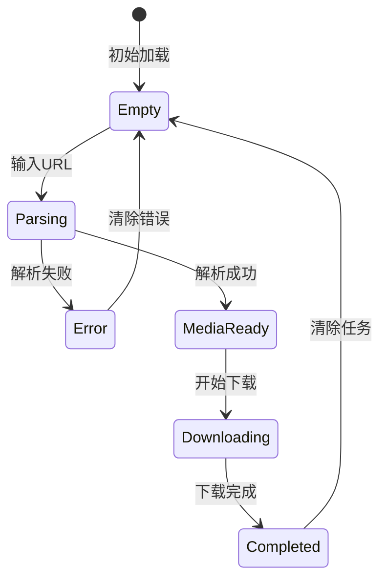

# Design Document: Video Downloader Redesign

## Overview

重新设计 VideoDownloader 页面，采用与项目其他页面一致的现代简约设计风格。核心设计理念是"简约大气、用户友好、视觉一致"。

## Architecture

### 页面结构

```
VideoDownloader
├── Header (标题 + 副标题)
├── Main Content Area
│   ├── Drop Zone (空状态)
│   │   ├── Icon (浅灰色背景)
│   │   ├── Title + Description
│   │   ├── URL Input (集成)
│   │   └── Format Tags (彩色)
│   ├── Media Card (解析成功后)
│   │   ├── Thumbnail
│   │   ├── Info (Title, Duration, Source)
│   │   └── Action Buttons
│   └── Download List (有下载任务时)
│       └── Download Items
└── Feature Cards (空状态底部)
```

### 状态流转



## Components and Interfaces

### 1. Header Component

```jsx
// 统一的页面头部样式
<div className="px-8 py-5 border-b border-slate-200/60 dark:border-slate-800/60 bg-white/50 dark:bg-slate-900/50 backdrop-blur-sm">
    <h1 className="text-xl font-semibold text-slate-800 dark:text-white tracking-tight">Media Downloader</h1>
    <p className="text-sm text-slate-500 dark:text-slate-400 mt-0.5">Download videos and audio from popular platforms</p>
</div>
```

### 2. Drop Zone Component

```jsx
// 空状态拖放区域
<div className="rounded-2xl border-2 border-dashed border-slate-200 dark:border-slate-700 p-12 text-center">
    {/* 图标 - 浅灰色背景 */}
    <div className="w-16 h-16 mx-auto mb-5 rounded-2xl bg-slate-100 dark:bg-slate-800 flex items-center justify-center">
        <span className="material-symbols-outlined text-slate-400 text-3xl">download</span>
    </div>
    
    {/* 标题和描述 */}
    <h3 className="text-lg font-semibold text-slate-700 dark:text-slate-200 mb-2">Paste URL to download</h3>
    <p className="text-slate-500 dark:text-slate-400 text-sm mb-5">or click to browse</p>
    
    {/* 彩色平台标签 */}
    <div className="flex gap-3 justify-center mb-6">
        <span className="text-[#FF0000] text-xs font-semibold">YouTube</span>
        <span className="text-[#1AB7EA] text-xs font-semibold">Vimeo</span>
        <span className="text-[#FF5500] text-xs font-semibold">SoundCloud</span>
        <span className="text-[#00D4AA] text-xs font-semibold">CDN Links</span>
    </div>
    
    {/* 集成的 URL 输入框 */}
    <div className="max-w-xl mx-auto">
        <div className="relative">
            <input className="w-full h-12 pl-12 pr-14 bg-white dark:bg-slate-800 border border-slate-200 dark:border-slate-700 rounded-xl" />
            <button className="absolute right-2 top-1/2 -translate-y-1/2 bg-gradient-to-r from-[#2196F3] to-[#42A5F5] text-white p-2 rounded-lg">
                <span className="material-symbols-outlined">arrow_forward</span>
            </button>
        </div>
    </div>
</div>
```

### 3. Media Card Component

```jsx
// 解析成功后的媒体卡片
<div className="bg-white dark:bg-slate-800/50 rounded-2xl border border-slate-100 dark:border-slate-800 overflow-hidden">
    <div className="flex gap-5 p-5">
        {/* 缩略图 */}
        
        
        {/* 信息区 */}
        <div className="flex-1 min-w-0">
            <h3 className="text-base font-semibold text-slate-900 dark:text-white mb-2 line-clamp-2">{title}</h3>
            <div className="flex items-center gap-4 text-sm text-slate-500 mb-4">
                <span>{duration}</span>
                <span>{source}</span>
            </div>
            
            {/* 下载按钮 */}
            <div className="flex gap-3">
                <button className="px-5 py-2.5 bg-gradient-to-r from-[#2196F3] to-[#42A5F5] text-white rounded-xl font-medium">
                    Download Video
                </button>
                <button className="px-5 py-2.5 border border-slate-200 dark:border-slate-700 text-slate-600 dark:text-slate-400 rounded-xl font-medium">
                    Audio Only
                </button>
                <button className="px-5 py-2.5 border border-slate-200 dark:border-slate-700 text-slate-600 dark:text-slate-400 rounded-xl font-medium">
                    Subtitles
                </button>
            </div>
        </div>
    </div>
</div>
```

### 4. Download List Component

```jsx
// 下载列表
<div className="bg-white dark:bg-slate-800/50 rounded-2xl border border-slate-100 dark:border-slate-800">
    <div className="px-5 py-4 border-b border-slate-100 dark:border-slate-800">
        <h3 className="text-xs font-bold text-slate-500 uppercase tracking-wider">Downloads</h3>
    </div>
    <div className="divide-y divide-slate-100 dark:divide-slate-800">
        {downloads.map(dl => (
            <DownloadItem key={dl.id} download={dl} />
        ))}
    </div>
</div>
```

### 5. Feature Cards Component

```jsx
// 功能特性卡片
<div className="grid grid-cols-3 gap-4 mt-8">
    {[
        { icon: 'verified', title: 'Secure Transfer', desc: 'Encrypted downloads' },
        { icon: 'bolt', title: 'Multi-threaded', desc: 'Fast parallel downloads' },
        { icon: 'folder_open', title: 'Auto-organize', desc: 'Smart file management' }
    ].map((item, i) => (
        <div key={i} className="p-5 rounded-2xl bg-white dark:bg-slate-800/50 border border-slate-100 dark:border-slate-800">
            <span className="material-symbols-outlined text-[#2196F3] text-2xl mb-3 block">{item.icon}</span>
            <h4 className="text-sm font-medium text-slate-700 dark:text-slate-200 mb-1">{item.title}</h4>
            <p className="text-xs text-slate-500 dark:text-slate-400">{item.desc}</p>
        </div>
    ))}
</div>
```

## Data Models

### Download State

```typescript
interface Download {
    id: string;
    title: string;
    thumbnail: string;
    progress: number;      // 0-100
    status: 'Starting...' | 'Active' | 'Paused' | 'Completed' | 'Failed';
    type: 'video' | 'audio' | 'subtitle';
    url: string;
    size?: string;
    filePath?: string;
}

interface VideoInfo {
    title: string;
    thumbnail: string;
    duration?: string;
    webpage_url: string;
    extractor: string;
    subtitles?: Record<string, any>;
    headers?: Record<string, string>;
}
```

## Correctness Properties

*A property is a characteristic or behavior that should hold true across all valid executions of a system-essentially, a formal statement about what the system should do. Properties serve as the bridge between human-readable specifications and machine-verifiable correctness guarantees.*

### Property 1: URL Parsing Triggers Correctly

*For any* valid URL string pasted into the input, the Video_Downloader SHALL initiate the parsing process and either display media info on success or show an error message on failure.

**Validates: Requirements 2.2, 2.4**

### Property 2: Media Info Display Completeness

*For any* successfully parsed media, the Media_Card SHALL display all required fields: thumbnail, title, and at least one download option.

**Validates: Requirements 3.1**

### Property 3: Download List Visibility

*For any* non-empty downloads state, the Download_List SHALL be visible and contain one item for each download in the state.

**Validates: Requirements 4.1**

### Property 4: Download Item Completeness

*For any* download item in the list, the rendered element SHALL contain: file icon, title, progress indicator, and status text.

**Validates: Requirements 4.2**

### Property 5: Completed Download Actions

*For any* download with status 'Completed', the download item SHALL display an "Open Folder" action button.

**Validates: Requirements 4.3**

## Error Handling

### Parsing Errors

- **Invalid URL**: "Please enter a valid video link"
- **404 Not Found**: "Video not found or has been deleted"
- **Timeout**: "Connection timeout, please check your network"
- **Unsupported Platform**: "This platform is not supported yet"

### Download Errors

- **Network Error**: Show retry option
- **Disk Full**: Show clear message with storage info
- **Permission Denied**: Guide user to check folder permissions

## Testing Strategy

### Unit Tests

- Test URL validation logic
- Test state transitions (empty → parsing → ready → downloading)
- Test error message mapping

### Property-Based Tests

- **Property 1**: Generate random valid/invalid URLs, verify correct state transitions
- **Property 2**: Generate random VideoInfo objects, verify all fields render
- **Property 3-5**: Generate random download states, verify correct rendering

### Integration Tests

- Test full flow: paste URL → parse → download → complete
- Test pause/resume functionality
- Test cancel functionality

### Visual Regression Tests

- Capture screenshots of all states (empty, parsing, ready, downloading, completed, error)
- Compare against baseline for design consistency
