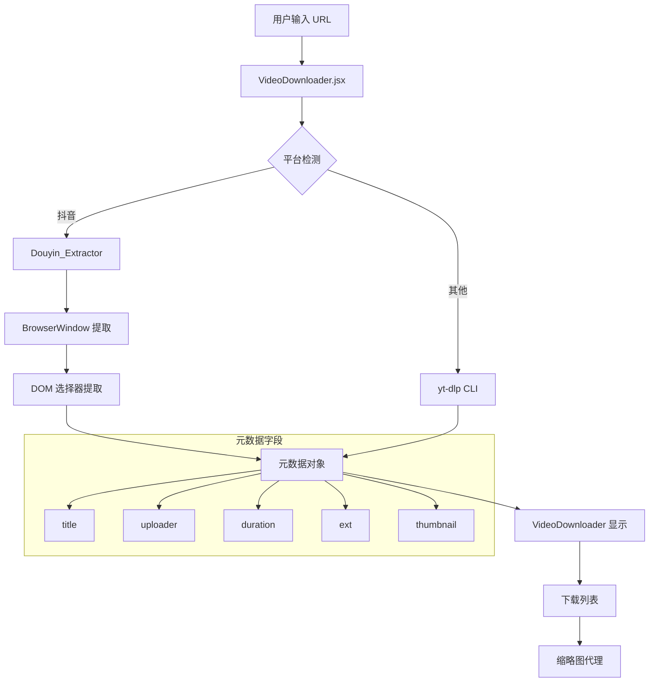

# Design Document: Video Metadata Display Fix

## Overview

本设计文档描述如何修复视频下载器中的元数据显示问题，包括作者信息、格式、时长和缩略图的正确提取和显示。

主要修改涉及两个层面：
1. **后端 (yt-dlp.js)**: 增强抖音视频元数据提取逻辑
2. **前端 (VideoDownloader.jsx)**: 确保元数据正确传递到下载列表并显示

## Architecture



## Components and Interfaces

### 1. Douyin Extractor 增强

**文件**: `src/main/services/yt-dlp.js`

**修改内容**:
- 增强作者提取逻辑，添加更多 DOM 选择器
- 添加时长提取逻辑
- 改进缩略图提取优先级

```javascript
// 增强的作者选择器列表
const authorSelectors = [
    '[data-e2e="user-title"]',
    '[data-e2e="user-info"] .author-name',
    '.author-card .author-name',
    '[class*="author-name"]',
    '[class*="AuthorName"]',
    '[class*="nickname"]',
    'a[href*="/user/"]',
    // Meta tags fallback
    'meta[name="author"]',
    'meta[property="og:author"]'
];

// 时长提取逻辑
const durationSelectors = [
    '[class*="duration"]',
    '[class*="time"]',
    'video'  // 从 video 元素获取 duration 属性
];
```

### 2. VideoDownloader 元数据传递

**文件**: `src/renderer/src/pages/VideoDownloader.jsx`

**修改内容**:
- 在 `handleDownload` 中传递完整元数据到下载项
- 确保 `thumbnailProxyUrl` 被正确传递
- 添加作者和时长到下载项显示

```javascript
// 下载项数据结构
const downloadItem = {
    id,
    title: videoInfo.title,
    thumbnail: thumbnailProxyUrl || videoInfo.thumbnail,  // 使用代理 URL
    uploader: videoInfo.uploader || 'Unknown',
    duration: videoInfo.duration_string || formatDuration(videoInfo.duration),
    format: outputFormat?.toUpperCase() || videoInfo.ext?.toUpperCase() || 'MP4',
    progress: 0,
    status: 'Starting...',
    type,
    url: downloadUrl
};
```

### 3. 下载列表 UI 增强

**修改内容**:
- 显示缩略图（使用代理 URL）
- 显示作者信息
- 显示格式和时长

## Data Models

### VideoInfo 对象

```typescript
interface VideoInfo {
    id: string;
    title: string;
    thumbnail: string | null;      // 缩略图 URL
    uploader: string;              // 作者名称，默认 "Unknown"
    duration: number | null;       // 时长（秒）
    duration_string: string | null; // 格式化时长 "MM:SS"
    url: string;                   // 视频流 URL
    webpage_url: string;           // 原始页面 URL
    ext: string;                   // 文件扩展名
    extractor: string;             // 提取器标识
    headers: object;               // HTTP 请求头
}
```

### DownloadItem 对象

```typescript
interface DownloadItem {
    id: string;
    title: string;
    thumbnail: string | null;      // 代理后的缩略图 URL
    uploader: string;              // 作者名称
    duration: string | null;       // 格式化时长
    format: string;                // 文件格式 (MP4, M4A 等)
    progress: number;              // 下载进度 0-100
    status: string;                // 状态
    type: 'video' | 'audio' | 'subtitle';
    url: string;
    size: string | null;           // 文件大小
    filePath: string | null;       // 下载完成后的文件路径
}
```

## Correctness Properties

*A property is a characteristic or behavior that should hold true across all valid executions of a system-essentially, a formal statement about what the system should do. Properties serve as the bridge between human-readable specifications and machine-verifiable correctness guarantees.*

### Property 1: Author Extraction with Fallbacks

*For any* Douyin page DOM structure containing author information in any supported location (data-e2e attributes, class names, or meta tags), the Douyin_Extractor SHALL successfully extract the author name.

**Validates: Requirements 1.1, 1.2**

### Property 2: Duration Formatting

*For any* duration value in seconds, the formatDuration function SHALL return a string in "MM:SS" format for durations under 1 hour, or "HH:MM:SS" format for durations of 1 hour or more.

**Validates: Requirements 3.2**

### Property 3: URL Normalization

*For any* thumbnail URL starting with "//", the normalization function SHALL prepend "https:" to produce a valid absolute URL.

**Validates: Requirements 5.3**

### Property 4: Proxy Domain Detection

*For any* thumbnail URL, the proxy detection function SHALL return true if and only if the URL contains domains requiring proxy (douyinpic.com, douyincdn.com, byteimg.com, hdslb.com, bilibili.com, etc.).

**Validates: Requirements 4.3**

### Property 5: Metadata Preservation

*For any* video with complete metadata (title, uploader, thumbnail, duration, format), when a download is initiated and completed, all metadata fields SHALL be preserved in the download item and history entry.

**Validates: Requirements 4.1, 6.1, 6.2, 6.3**

### Property 6: Thumbnail Extraction Priority

*For any* Douyin page containing thumbnail information, the Douyin_Extractor SHALL extract thumbnail from sources in priority order: video poster > og:image > twitter:image > link[rel="image_src"].

**Validates: Requirements 5.1, 5.2**

## Error Handling

### 作者提取失败
- 尝试所有选择器后仍无法获取 → 返回 "Unknown"
- 不影响其他元数据提取

### 时长提取失败
- 无法从 DOM 获取时长 → 返回 null
- UI 隐藏时长显示区域

### 缩略图提取失败
- 无法获取缩略图 URL → 返回 null
- UI 显示默认视频图标占位符

### 缩略图代理失败
- 代理请求失败 → 回退到原始 URL
- 原始 URL 也失败 → 显示占位符

## Testing Strategy

### Unit Tests

1. **formatDuration 函数测试**
   - 测试秒数转换为 MM:SS 格式
   - 测试超过 1 小时的 HH:MM:SS 格式
   - 测试边界值 (0, 59, 60, 3599, 3600)

2. **URL 规范化测试**
   - 测试 "//" 开头的 URL 转换
   - 测试已经是完整 URL 的情况

3. **代理域名检测测试**
   - 测试各种需要代理的域名
   - 测试不需要代理的域名

### Property-Based Tests

使用 fast-check 库进行属性测试：

1. **Duration Formatting Property**
   - 生成随机秒数，验证输出格式正确

2. **URL Normalization Property**
   - 生成随机 URL，验证规范化逻辑

3. **Metadata Preservation Property**
   - 生成随机元数据对象，验证传递完整性

### Integration Tests

1. **抖音视频元数据提取**
   - 使用真实抖音 URL 测试完整提取流程
   - 验证所有字段都被正确填充

2. **下载列表显示**
   - 模拟下载流程，验证 UI 正确显示所有元数据
