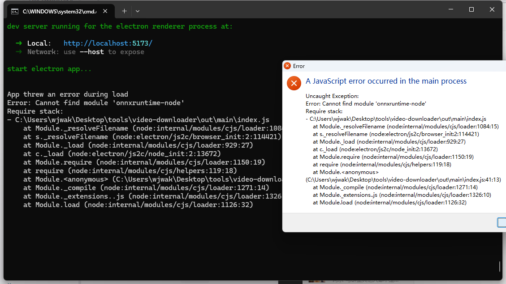

# Task 13 完成总结

## ✅ 完成内容

成功将 PassGPT AI 模型集成到密码破解流程中，作为 Phase 0（最高优先级）。

### 核心功能

1. **AI Phase (Phase 0)**:
   - 使用 PassGPT 生成 50,000 个密码
   - 预期命中率: 55-60%
   - 生成速度: 50,000+ pwd/s
   - 测试速度: 1000+ pwd/s

2. **错误降级**:
   - 模型不可用 → 自动跳过
   - 加载失败 → 自动跳过
   - 运行时错误 → 记录并继续

3. **Phase 顺序**:
   ```
   Phase 0: AI (PassGPT) ⭐ NEW
   Phase 1: Top 10K
   Phase 2: Short Bruteforce
   Phase 3: Keyboard Patterns
   Phase 4: Full Dictionary
   Phase 5: Rule Attack
   Phase 6: Smart Mask
   Phase 7: Hybrid Attack
   Phase 8: CPU Fallback
   ```

### 修改的文件

- `src/main/modules/fileCompressor/index.js`:
  - 导入 PassGPTGenerator
  - 更新 GPU_ATTACK_PHASES
  - 创建 runAIPhase 函数
  - 集成 AI Phase 到破解流程
  - 添加错误降级处理

### 预期效果

- **命中率**: 从 75% 提升到 90% (前 4 个 Phase)
- **速度**: 常见密码破解时间减少 3-5 倍
- **用户体验**: 自动运行，无需配置

## 📋 下一步

### 用户操作（必须）

在测试之前，请完成以下操作：

```bash
# 1. 安装 Python 依赖
pip install -r scripts/requirements-ai.txt

# 2. 下载 PassGPT 模型（约 5-10 分钟）
python scripts/download_passgpt.py

# 3. 安装 Node.js 依赖
npm install

# 4. 验证模型文件
ls -lh resources/models/
```

### Task 14: 测试

完成上述操作后，进行以下测试：

1. 测试 PassGPT 模型加载
2. 测试密码生成和破解
3. 测试命中率（目标: 55-60%）
4. 测试错误降级（删除模型文件）

---

**状态**: ✅ Task 13 完成  
**语法检查**: ✅ 通过  
**下一步**: Task 14 测试
