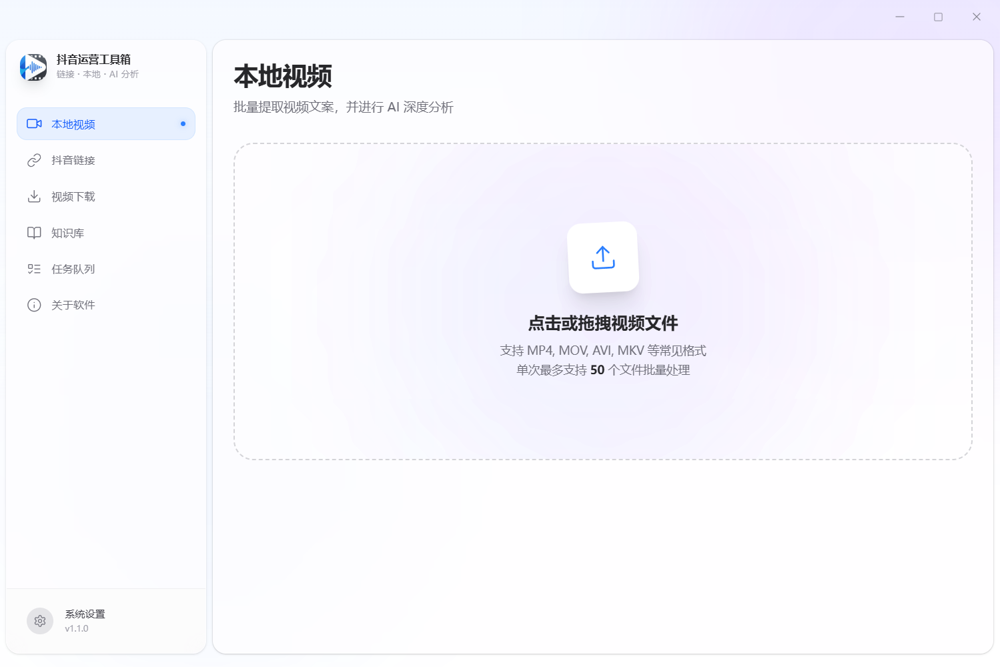
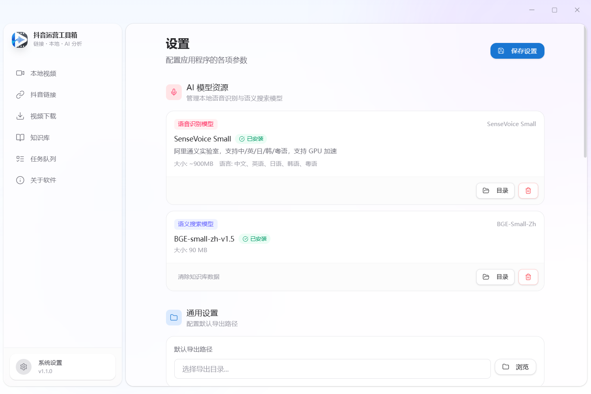
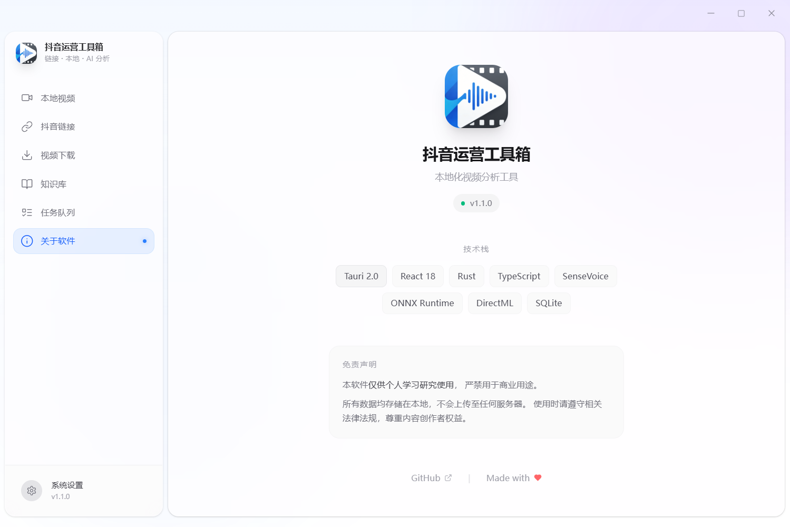

<h1 align="center">🎬 抖音运营工具箱</h1>

<p align="center">
  <strong>批量提取视频文案 + AI 深度分析 | 完全免费 | 本地运行</strong>
</p>

<p align="center">
  
  
  
  
</p>

---

## ✨ 功能亮点

| 功能 | 说明 |
|------|------|
| 📹 **本地视频批量转写** | 拖入视频一键提取文案，单次最多 50 个 |
| 🔗 **抖音链接批量提取** | 粘贴抖音分享链接，自动获取视频文案 |
| 🤖 **AI 深度分析** | 一键分析视频结构（开头钩子、铺垫、包袱、结尾引导） |
| 💬 **全库 AI 对话** | 与 AI 讨论所有视频，总结爆款规律 |
| 📚 **私有知识库** | 导入行业资料，让 AI 分析更精准 |
| ⚡ **GPU 加速** | 支持 NVIDIA CUDA 加速，转写速度翻倍 |

---

## 📸 界面预览

| 首页 | 设置页面 | 关于软件 |
|:---:|:---:|:---:|
|  |  |  |

---

## 🚀 快速开始

### 方式一：直接下载安装包（推荐）

#### 📥 百度网盘（推荐国内用户）
| 文件 | 链接 | 提取码 |
|------|------|--------|
| 抖音运营工具箱_1.1.0.zip | [点击下载](https://pan.baidu.com/s/1ZlUrG2yC18sklHc71cIMOA) | `8888` |

#### 🌐 GitHub Releases
前往 [Releases](https://github.com/lid664951-crypto/douyin-creator-toolkit/releases) 下载最新版

### 方式二：从源码构建

#### 环境要求
- Node.js 18+
- Rust 1.70+
- Python 3.11+
- pnpm

#### 构建步骤
```bash
# 克隆仓库
git clone https://github.com/lid664951-crypto/douyin-creator-toolkit.git
cd douyin-creator-toolkit

# 安装依赖
pnpm install

# 开发模式运行
pnpm tauri dev

# 打包生产版本
pnpm tauri build
```

---

## 📦 模型下载

首次运行需要下载 ASR 模型（约 900MB）：

1. 打开软件 → 设置 → AI 模型与资源
2. 点击「下载语音识别模型」
3. 等待下载完成后即可使用

---

## 🛠️ 技术栈

- **前端**：React + TypeScript + TailwindCSS
- **后端**：Rust + Tauri 2.0
- **语音识别**：Python + [sherpa-onnx](https://github.com/k2-fsa/sherpa-onnx) + [SenseVoice](https://github.com/FunAudioLLM/SenseVoice)
- **抖音解析**：[dy-mcp](https://modelscope.cn/mcp/servers/vipcong816/dy-mcp)（魔塔社区）
- **AI 分析**：豆包 API / LM Studio（本地大模型）

---

## ❓ 常见问题

<details>
<summary><b>Q: 转写速度很慢怎么办？</b></summary>

A: 设置 → 性能优化 → 启用 GPU 加速（需要 NVIDIA 显卡）
</details>

<details>
<summary><b>Q: 支持 Mac 吗？</b></summary>

A: 暂不支持，仅限 Windows 10/11
</details>

<details>
<summary><b>Q: AI 分析需要联网吗？</b></summary>

A: 需要。默认使用豆包 API，也可切换到本地 LM Studio
</details>

---

## 🤝 贡献指南

欢迎提交 Issue 和 Pull Request！

---

## 📄 开源协议

本项目基于 [MIT License](./LICENSE) 开源。

---

## 🙏 致谢

- [Tauri](https://tauri.app/) - 跨平台桌面应用框架
- [dy-mcp](https://modelscope.cn/mcp/servers/vipcong816/dy-mcp) - 抖音链接解析 & 无水印下载（魔塔社区）
- [SenseVoice](https://github.com/FunAudioLLM/SenseVoice) - 阿里通义实验室语音识别模型
- [sherpa-onnx](https://github.com/k2-fsa/sherpa-onnx) - 高性能语音识别推理引擎
