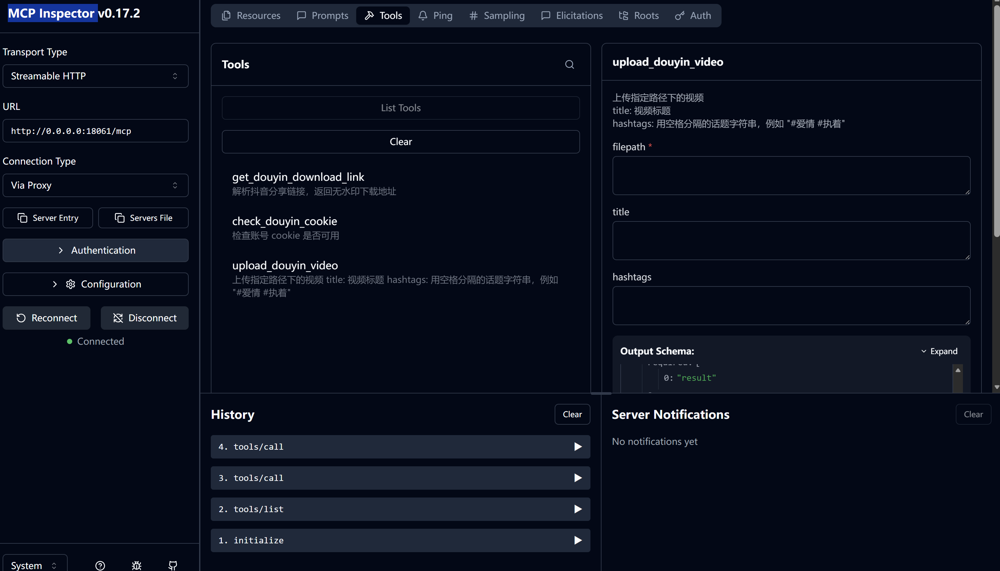
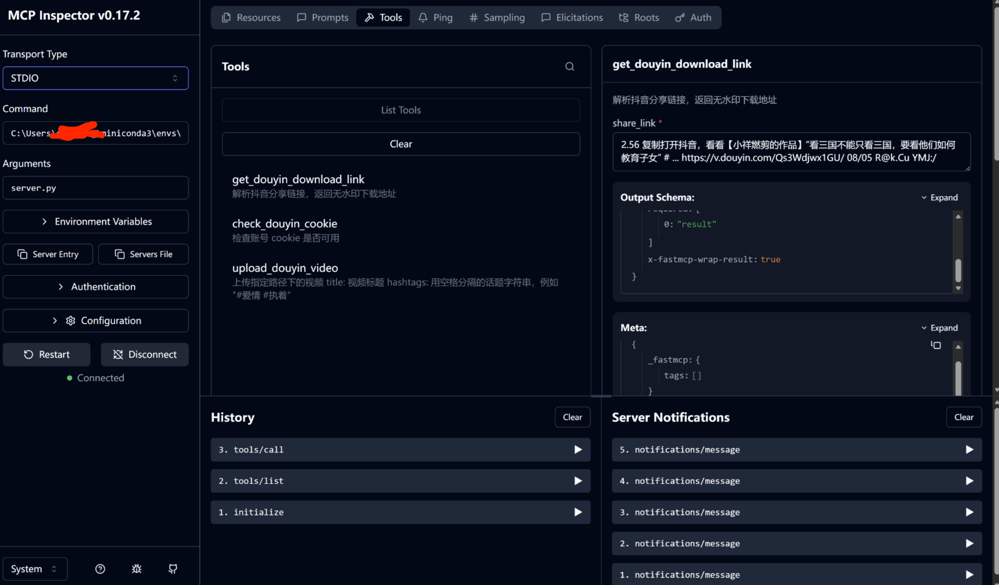

# dy-mcp


`dy-mcp` 是一个强大的自动化抖音dy-mcp工具，旨在帮助内容创作者和运营者高效地使用抖音自动化工具，快速上手。

> 🎬 预览视频  


## 功能特性

- [💡 解析抖音分享链接，返回无水印下载地址](#💡解析抖音分享链接，返回无水印下载地址)
- [🚀 上传指定路径下的视频](#🚀上传指定路径下的视频)
- [🚀 生成剪映草稿](#🚀生成剪映草稿)


## 💾安装指南

1.  **克隆项目**:
    ```bash
    git clone https://github.com/vipcong816/dy-mcp.git
    cd dy-mcp
    ```

2.  **安装依赖**:
    建议在虚拟环境中安装依赖。
    ```bash
    conda create -n dy-mcp python=3.10
    conda activate dy-mcp
    # 挂载清华镜像 or 命令行代理
    pip install -r requirements.txt
    ```

3.  **安装 Playwright 浏览器驱动**:
    ```bash
    playwright install chromium firefox
    ```
    根据您的需求，至少需要安装 `chromium`。`firefox` 主要用于 TikTok 上传（旧版）。

4.  **修改配置文件**:
    在 `server.py` 中，您需要配置以下内容：
    -   `LOCAL_CHROME_PATH`: 本地 Chrome 浏览器的路径，比如 `C:\Program Files\Google\Chrome\Application\chrome.exe` 保存。
    
    **临时解决方案**

    需要在根目录创建 `cookiesFile` 和 `videoFile` 两个文件夹，分别是 存储cookie文件 和 存储上传文件 的文件夹


5.  **启动项目**:
    ```bash
    python server_streamable_http.py
    ```
	
6.  **STDIO配置**:
    ```bash
	{
	  "mcpServers": {
		"dyn-mcp": {
		  "command": "C:/Users/你的用户名/miniconda3/envs/环境名/python.exe",
		  "args": ["server.py"]
		}
	  }
	}
    ```

7.  **MCP Inspector 配置**:
    ```bash
    npx @modelcontextprotocol/inspector
    ```
    streamable_httt如图所示

	
	
	STDIO如图所示
	